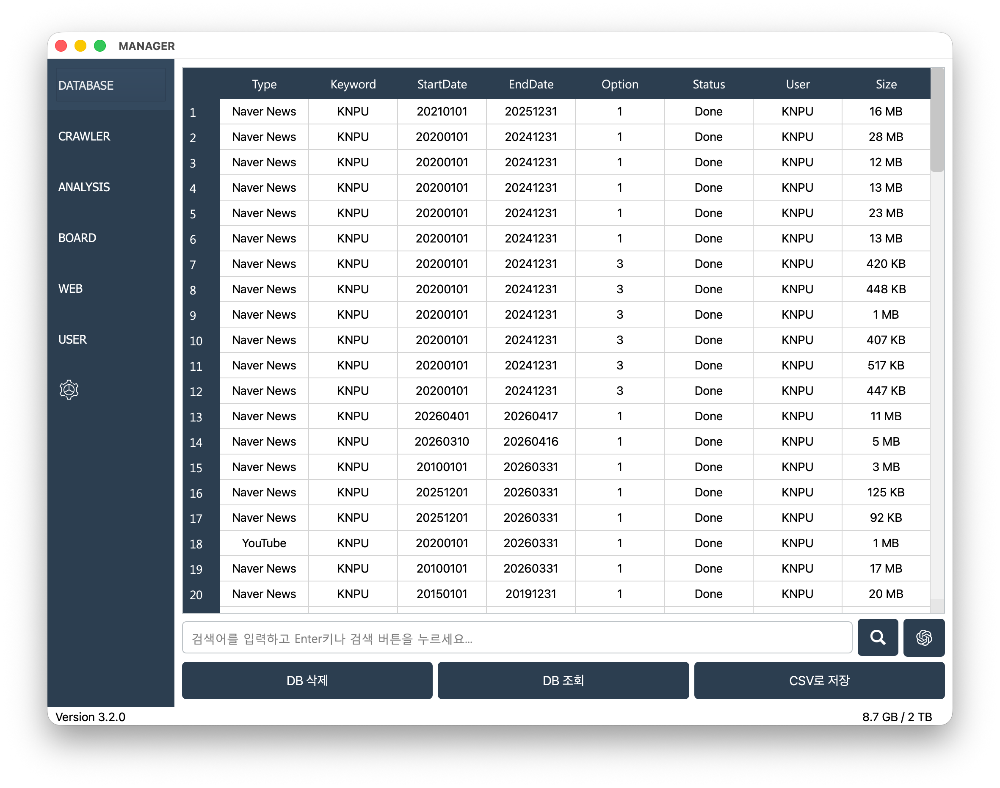
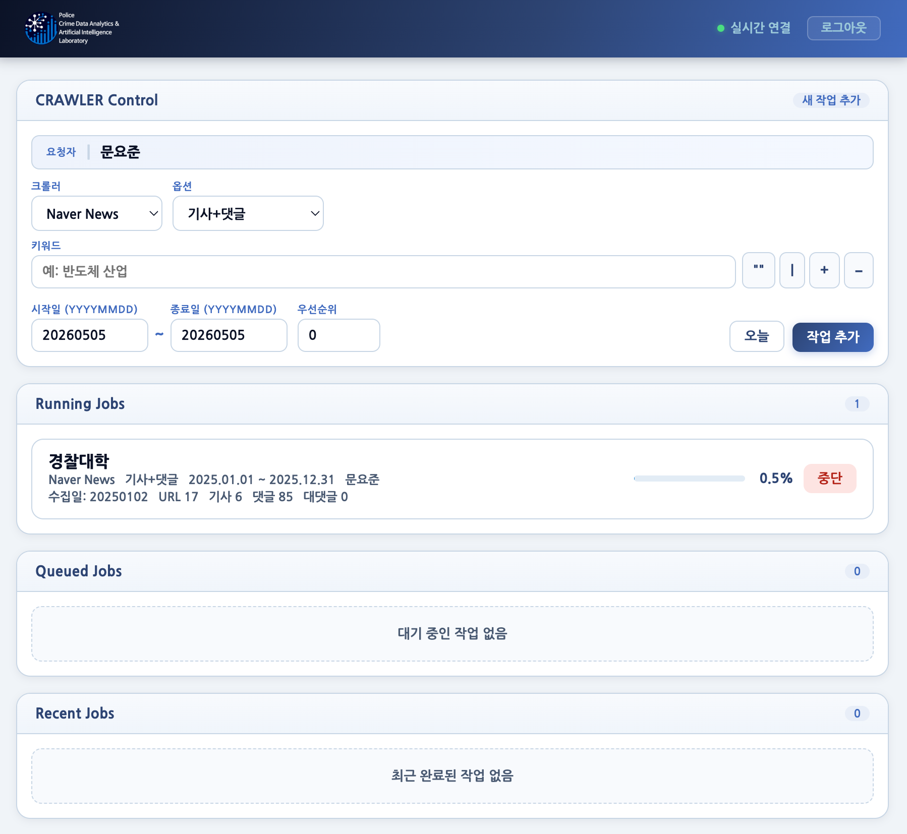
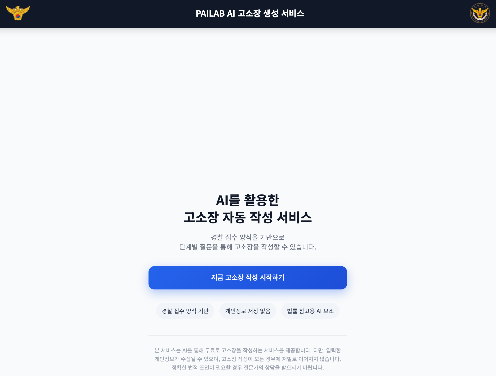

# KNPU Research System

A dashboard of core services designed for an efficient research environment.

---

## MANAGER

> An integrated platform supporting research resource management and big data analysis.

[**Launch**](https://knpu.re.kr/manager)

---

## CRAWLER

> Builds datasets through large-scale data collection.

[**Launch**](https://crawler.knpu.re.kr)

---

## AI Legal Complaint Generation Service

> A service that assists in generating draft legal complaints meeting legal requirements using LLMs.

[**Launch**](https://complaint.knpu.re.kr)

---

### Footer
© 2026 **PAILAB**. All rights reserved.
Developed by [**Yojun Moon**](https://github.com/yojun313)