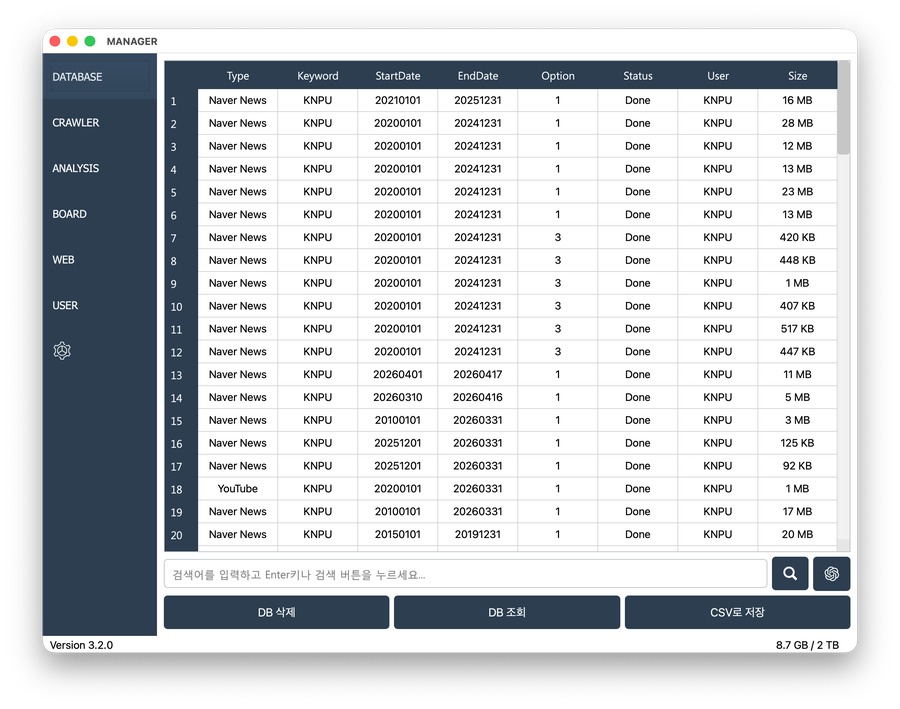
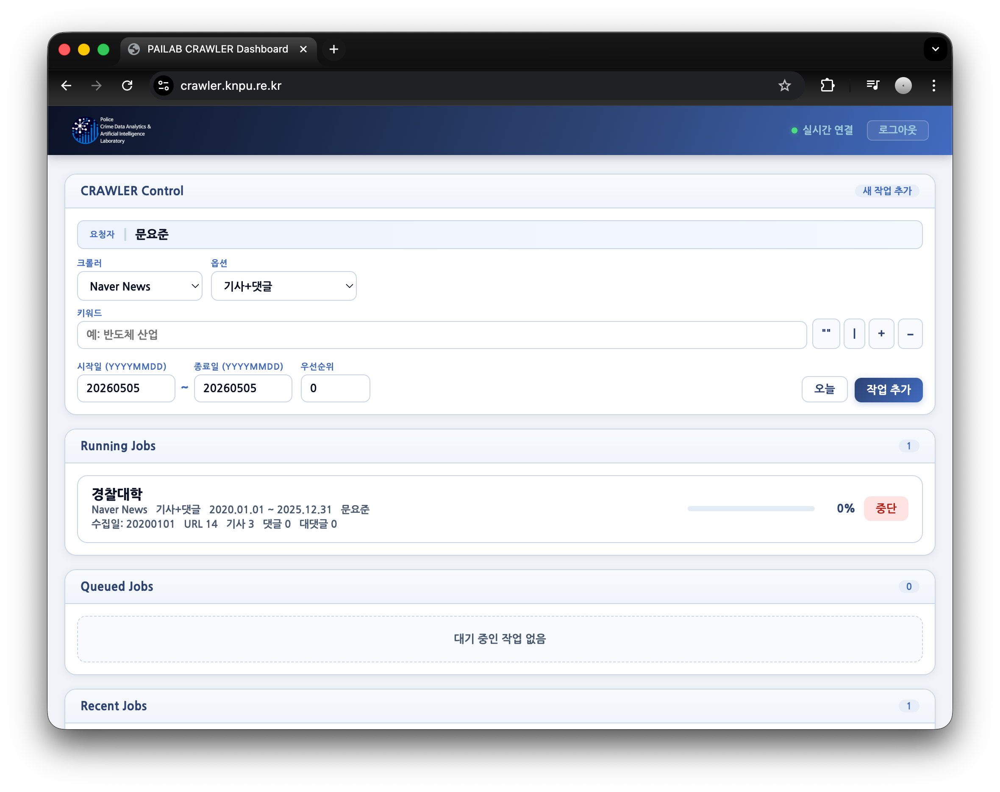
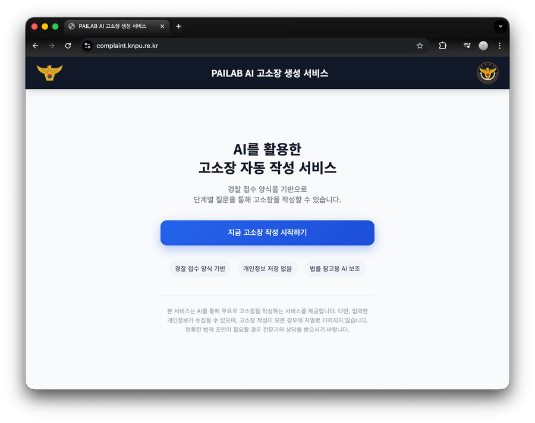

# KNPU PAILAB Research System

Research System for **PAILAB** at **Korea National Police University**.

---

## MANAGER
> An integrated platform supporting research resource management and big data analysis.


[**Open**](https://knpu.re.kr/manager)

---

## CRAWLER
> Builds datasets through large-scale data collection.


[**Open**](https://crawler.knpu.re.kr)

---

## AI Legal Complaint Generation Service
> A service that assists in generating draft legal complaints meeting legal requirements using LLMs.


[**Open**](https://complaint.knpu.re.kr)

---

## Development & Operations

This system utilizes a `uv` workspace structure for centralized dependency management. Use the following commands to selectively synchronize dependencies or run specific services simultaneously.

### Selective Dependency Synchronization (Dependency Sync)
Instead of syncing the entire workspace, you can combine the `-p` (`--package`) flags to reflect dependencies of only the specific services you are developing into the virtual environment (`.venv`).

```bash
# Example 1. Sync All
uv sync

# Example 2: Sync specific services (homepage and admin) simultaneously
uv sync -p homepage -p admin

# Example 3: Sync the crawler system standalone
uv sync -p crawler
```
    
### Footer
© 2026 **PAILAB**. All rights reserved.
Developed by [**Yojun Moon**](https://github.com/yojun313)