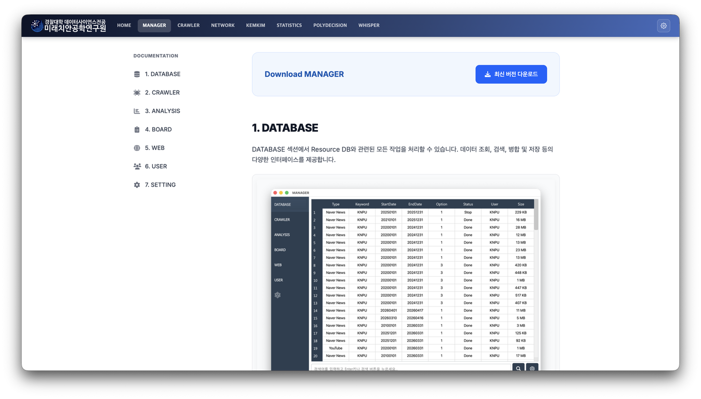
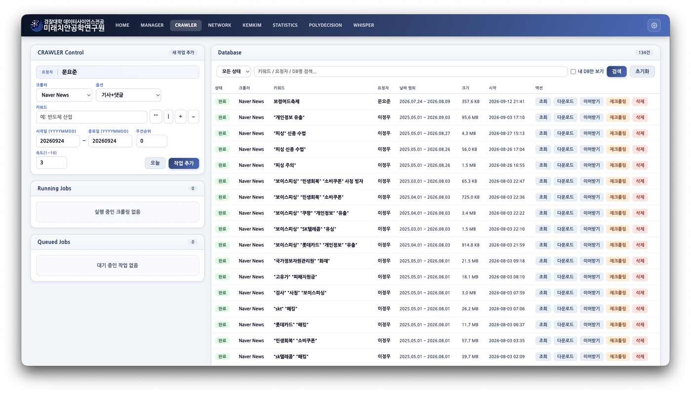
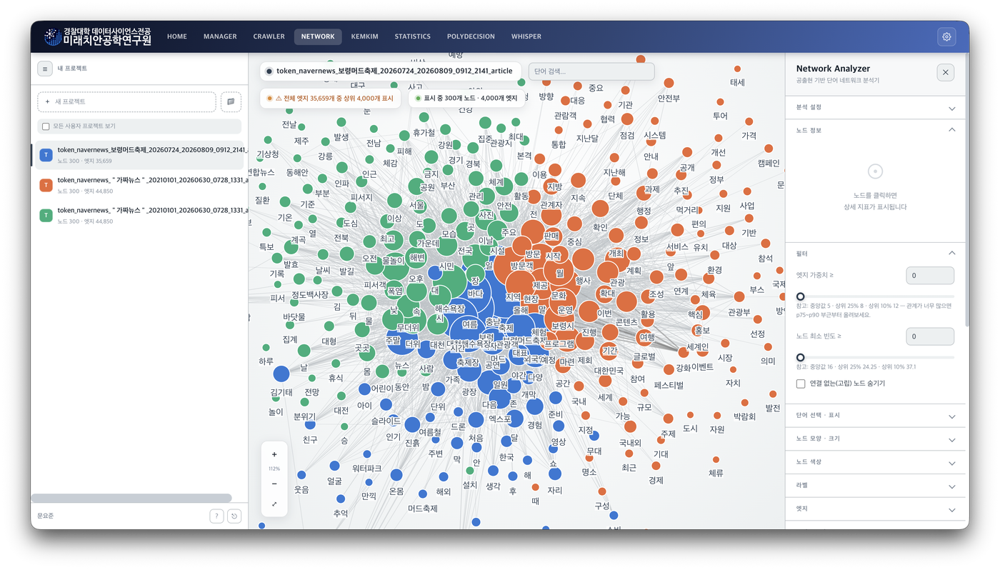
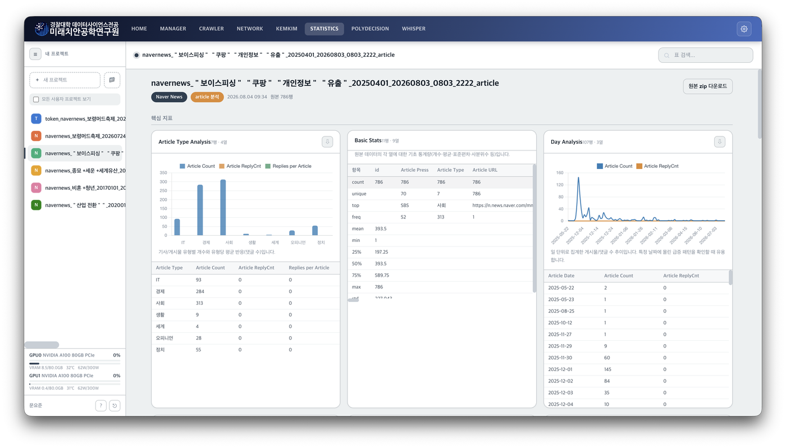
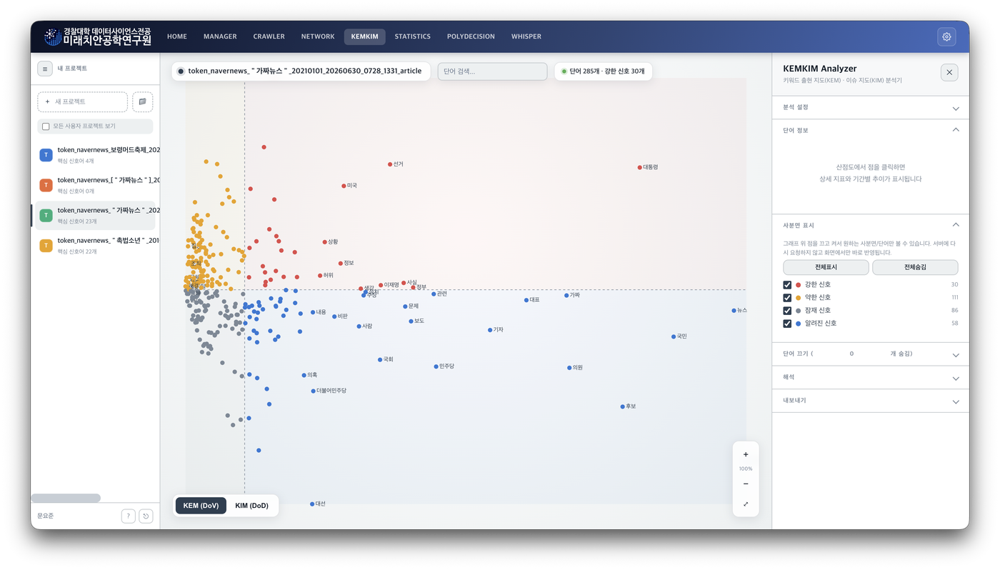
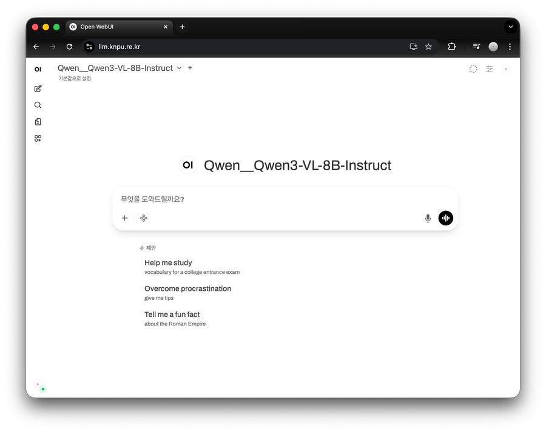
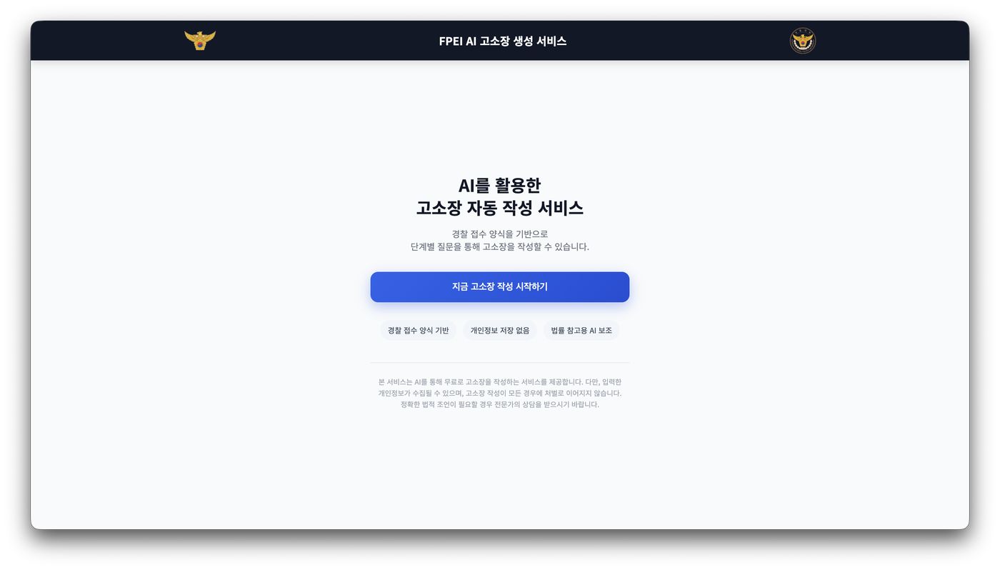
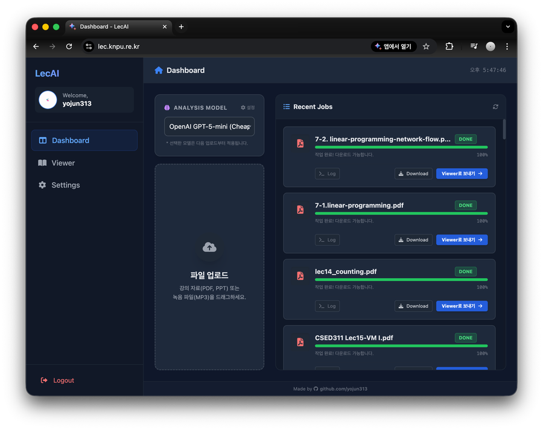

<div align="center">

# KNPU FPEI Research System

Research System for **FPEI** at **Korea National Police University**

[](https://manager.knpu.re.kr)
[](https://crawler.knpu.re.kr)
[](https://network.knpu.re.kr)
[](https://statistics.knpu.re.kr)
[](https://kemkim.knpu.re.kr)
[](https://llm.knpu.re.kr)
[](https://complaint.knpu.re.kr)
[](https://lec.knpu.re.kr)

</div>

<br>

<div align="center">

## MANAGER



[](https://manager.knpu.re.kr)

</div>

<br>

<div align="center">

## CRAWLER



[](https://crawler.knpu.re.kr)

</div>

<br>

<div align="center">

## NETWORK



[](https://network.knpu.re.kr)

</div>

<br>

<div align="center">

## STATISTICS



[](https://statistics.knpu.re.kr)

</div>

<br>

<div align="center">

## KEMKIM



[](https://kemkim.knpu.re.kr)

</div>

<br>

<div align="center">

## Lab LLM



[](https://llm.knpu.re.kr)

</div>

<br>

<div align="center">

## AI Legal Complaint Generation Service



[](https://complaint.knpu.re.kr)

</div>

<br>

<div align="center">

## LecAI



[](https://lec.knpu.re.kr)

</div>

---

## 개발 환경 구성 (Development)

이 저장소는 **uv 워크스페이스**로 구성되어 있습니다. 서비스마다 별도 가상환경을 두지 않고, **저장소 루트의 `.venv` 가상환경을 모든 서비스가 공유합니다.**

```bash
# 저장소 루트에서 한 번만
uv sync
```

`homepage` / `admin` / `crawler` / `complaint` / `manager/app` / `system/bot`은 각자 `pyproject.toml`로 자신이 실제로 쓰는 의존성을 명시해둔 워크스페이스 멤버입니다(무엇이 무엇을 쓰는지 추적하기 위한 문서화 목적이며, 그 안에서 `uv sync`를 실행해도 결국 같은 루트 `.venv`를 갱신합니다). `network` / `kemkim` / `statistics` / `ahp` / `manager/server` / `manager/web`처럼 별도 `pyproject.toml`이 없는 서비스는 루트의 통합 의존성 목록을 그대로 씁니다.

> `manager/app`(PyInstaller로 빌드하는 데스크톱 클라이언트)만 예외입니다. 자체 `uv.lock`을 따로 갖고 있어 서버 워크스페이스와 분리해서 빌드합니다 — 자세한 내용은 `manager/app/compile/` 참고.

---

## 배포 및 실행 방법 (pm2 + ecosystem.config.js)

### 구조 한눈에 보기

- **`services.json`** — 서비스별 포트(prod/dev)와 도메인(prod/dev)을 관리하는 단일 소스입니다. `system/endpoints.py`, `/shared-ui/services.js`에서 이 파일을 참조합니다.
- **`ecosystem.dev.config.js`** / **`ecosystem.prod.config.js`** — pm2로 각 서비스를 띄우는 설정입니다.
- **`MODE` 환경변수** — `0`이면 dev(`dev-*.knpu.re.kr`, 18xxx 포트), `1`이면 prod(`*.knpu.re.kr`, 8xxx 포트)입니다.

### 처음 배포할 때

```bash
# 1. 저장소 클론
git clone git@github.com:yojun313/knpu.git
cd knpu

# 2. 루트 .venv 구성
uv sync

# 3. .env 파일 준비
cp .env.example .env
# 값 채워넣기

# 4. pm2로 전체 서비스 기동
pm2 start ecosystem.prod.config.js   # 운영
pm2 start ecosystem.dev.config.js    # 개발(dev-*.knpu.re.kr)
```

### 코드 배포(업데이트) 시

```bash
git pull

# 특정 서비스만 재시작 (예: homepage)
pm2 restart homepage

# ecosystem 파일 자체(포트 매핑 등)를 바꿨다면 --update-env로 환경변수까지 다시 반영
pm2 restart ecosystem.prod.config.js --update-env
```

---

<div align="center">

© 2026 **FPEI**. All rights reserved.
Developed by [**Yojun Moon**](https://github.com/yojun313), [**Woochul Choi**](https://github.com/WCChoi0930)

</div>
